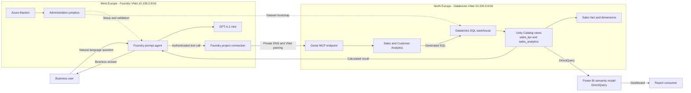

# Private Microsoft Foundry Agent with Databricks Genie

This repository demonstrates a network-isolated Microsoft Foundry agent that answers natural-language business questions using governed data in Azure Databricks. The agent calls a Databricks Genie space through Model Context Protocol (MCP), allowing Genie to generate and run SQL while the Foundry model presents the result in clear business language.

The sample includes Azure infrastructure as code, private cross-region networking, a synthetic sales dataset, Databricks bootstrap automation, a Python agent client, connectivity checks, and a customer-ready demonstration walkthrough.

> [!IMPORTANT]
> This repository contains a demonstration environment, not a production reference implementation. The validated sandbox connection uses a short-lived Databricks personal access token (PAT). Use Databricks OAuth identity passthrough or another renewable managed identity mechanism for production.

## Architecture



Public network access is disabled for the Foundry and Databricks environments. Runtime traffic uses private endpoints, private DNS, and bidirectional VNet peering. Azure Bastion and the jumpbox form a separate administrator path.

The agent and the Power BI dashboard read the same two Unity Catalog views, so a figure quoted by the agent and the same figure on the dashboard come from one SQL definition rather than two independent calculations.

## What This Repository Deploys

| Area | Components |
| --- | --- |
| Foundry | Foundry account and project, `gpt-4.1-mini` deployment, capability host, private endpoints, and supporting data resources |
| Network | West Europe VNet with agent, private endpoint, MCP, Bastion, and jumpbox subnets |
| Databricks | North Europe VNet-injected workspace, private endpoints, private DNS, and cross-region peering |
| Data | Synthetic star schema with sales, product, customer, and plant data, plus the `sales_analytics` and `sales_kpi` views |
| Agent | Python prompt agent configured with a private Databricks Genie MCP tool |
| Reporting | Power BI project (PBIP) with a DirectQuery semantic model over the same views |
| Operations | Staged deployment script, bootstrap script, and private-connectivity verification |

## Repository Layout

```text
.
|-- databricks/
|   |-- bootstrap.ps1             # Creates/reuses the SQL warehouse and loads data
|   `-- sql/01_genie_dataset.sql  # Star schema plus the shared metric views
|-- docs/
|   `-- customer-demo-walkthrough.md
|-- infra/
|   |-- deploy.ps1                # Orchestrates the three deployment stages
|   |-- verify.ps1                # Validates peering, DNS links, and Foundry isolation
|   |-- network/                  # Foundry VNet, Bastion, and jumpbox
|   |-- databricks/               # Databricks workspace, DNS, and VNet peering
|   `-- foundry/                  # Network-secured Foundry template and modules
|-- powerbi/
|   |-- FoodAnalytics.pbip
|   |-- FoodAnalytics.SemanticModel/  # TMDL model, DirectQuery over the shared views
|   `-- FoodAnalytics.Report/         # PBIR report definition
`-- src/
    `-- genie_agent.py            # Creates and invokes the Genie-enabled agent
```

For the customer presentation script, verified result, and a simplified explanation, see [Customer demo walkthrough](docs/customer-demo-walkthrough.md).

## Prerequisites

Before deploying, you need:

- An Azure subscription where you can create resources and role assignments.
- PowerShell 7 or Windows PowerShell 5.1.
- Azure CLI, signed in with `az login`.
- Bicep support through Azure CLI.
- Databricks CLI on the jumpbox or another machine inside the private network.
- Python 3.10 or later for the agent client.
- Capacity for the selected Azure OpenAI model and the required regional Azure services.
- Non-overlapping address spaces for the Foundry, Databricks, and any connected on-premises networks.

The deployment script checks and registers these resource providers:

- `Microsoft.CognitiveServices`
- `Microsoft.Databricks`
- `Microsoft.Network`
- `Microsoft.Compute`
- `Microsoft.App`
- `Microsoft.ContainerService`
- `Microsoft.KeyVault`
- `Microsoft.Storage`
- `Microsoft.Search`

## Configuration

Review the three parameter files before deployment:

- [`infra/network/food-analytics.bicepparam`](infra/network/food-analytics.bicepparam) controls the Foundry network, subnets, Bastion, and jumpbox.
- [`infra/foundry/food-analytics.bicepparam`](infra/foundry/food-analytics.bicepparam) controls the Foundry account, project, model, and supporting resources.
- [`infra/databricks/food-analytics.bicepparam`](infra/databricks/food-analytics.bicepparam) controls the Databricks workspace, network, and public-access setting.

The included defaults use:

| Setting | Value |
| --- | --- |
| Foundry region | West Europe |
| Foundry VNet | `10.100.0.0/16` |
| Databricks region | North Europe |
| Databricks VNet | `10.200.0.0/16` |
| Model | `gpt-4.1-mini`, version `2025-04-14` |
| Model SKU | `GlobalStandard` |
| Databricks public access | Disabled |

The Foundry parameter file expects an existing Cosmos DB account. Set `AZURE_COSMOSDB_ACCOUNT_RESOURCE_ID` to a resource ID from your subscription before deploying, or leave it empty to let the template create one. Check regional capacity before choosing replacement regions or model capacity.

Do not place passwords, PATs, connection strings, or API keys in parameter files. The jumpbox password is requested securely by `infra/deploy.ps1`, held in `JUMPBOX_ADMIN_PASSWORD` for the deployment, and then removed from the process environment.

## Deploy the Infrastructure

Set reusable values in your PowerShell session:

```powershell
$subscriptionId = '<azure-subscription-id>'
$resourceGroup = '<foundry-resource-group>'
```

Deploy each stage in order:

```powershell
./infra/deploy.ps1 `
  -SubscriptionId $subscriptionId `
  -ResourceGroup $resourceGroup `
  -Stage network

./infra/deploy.ps1 `
  -SubscriptionId $subscriptionId `
  -ResourceGroup $resourceGroup `
  -Stage foundry

./infra/deploy.ps1 `
  -SubscriptionId $subscriptionId `
  -ResourceGroup $resourceGroup `
  -Stage connectivity
```

The stages perform the following work:

1. `network` creates the West Europe VNet, five subnets, Azure Bastion, and the jumpbox.
2. `foundry` imports the network deployment outputs and creates the network-secured Foundry environment.
3. `connectivity` creates the North Europe Databricks environment, bidirectional peering, private endpoints, and private DNS links.

Use `-WhatIf` with an individual stage to preview changes. The Foundry capability host can take more than 30 minutes to provision; do not cancel the deployment while it is still progressing.

## Bootstrap Databricks

Because the Databricks workspace has public access disabled, perform these steps from the jumpbox, VPN, or another host with private network access.

Install and authenticate the Databricks CLI:

```powershell
winget install Databricks.CLI
databricks auth login --host 'https://<workspace-host>' --profile DEFAULT
```

Create or reuse the SQL warehouse and load the sample data:

```powershell
./databricks/bootstrap.ps1 `
  -WorkspaceUrl 'https://<workspace-host>' `
  -ProfileName DEFAULT
```

The script selects an existing usable Unity Catalog catalog, creates the `sales` schema, and loads the following tables:

- `fact_sales`
- `dim_product`
- `dim_customer`
- `dim_plant`

It then creates the two views that both the agent and Power BI consume:

- `sales_analytics` - daily sales metrics by product, customer, and plant attributes. Aggregate its additive measure columns for any filtered or grouped question.
- `sales_kpi` - the all-time dashboard KPI values as one row per metric, used for unfiltered totals.

These views are the shared semantic contract. Changing a business definition means changing it once here, and both the agent and the dashboard follow.

The SQL source uses `food_analytics` as a logical catalog name. The bootstrap script rewrites it to the selected workspace catalog at runtime. Supply `-CatalogName '<catalog>'` when automatic discovery is not appropriate.

## Create the Genie Space

In the Databricks workspace:

1. Open **SQL > Genie** and create a space.
2. Attach it to the SQL warehouse created by the bootstrap script.
3. Add only the two views `<catalog>.sales.sales_analytics` and `<catalog>.sales.sales_kpi`.
4. Add descriptions and example questions appropriate to your business vocabulary.
5. Copy the space ID from the Genie URL.

Adding only the views, rather than the underlying tables, is what stops Genie from computing a total in a way the dashboard does not reproduce.

The MCP endpoint has this form:

```text
https://<workspace-host>/api/2.0/mcp/genie/<space-id>
```

## Configure the Foundry Connection

Create a Foundry project connection named `databricks-genie-mcp`. For the sandbox, it is a custom-key connection containing an `Authorization` value in the form `Bearer <databricks-token>`.

Never store the token in this repository or pass it as a command-line argument. Use a short lifetime for sandbox PATs and rotate the connection when the token expires. For production, use Databricks OAuth identity passthrough or another managed, renewable credential design.

The identity creating agent versions also needs the Foundry agent data actions, including `Microsoft.CognitiveServices/accounts/AIServices/agents/*`, plus the appropriate project runtime role.

## Run the Agent

Install the Python dependencies in a virtual environment:

```powershell
python -m venv .venv
./.venv/Scripts/Activate.ps1
python -m pip install azure-ai-projects azure-identity openai
```

Set the non-secret runtime configuration:

```powershell
$env:PROJECT_ENDPOINT = 'https://<foundry-account>.services.ai.azure.com/api/projects/<project-name>'
$env:MODEL_NAME = 'gpt-4.1-mini'
$env:GENIE_MCP_URL = 'https://<workspace-host>/api/2.0/mcp/genie/<space-id>'
$env:GENIE_CONNECTION_ID = '<foundry-project-connection-resource-id>'
```

Authenticate with an identity that has access to the Foundry project, then run:

```powershell
az login
python ./src/genie_agent.py
```

The script creates a version of `genie-agent`, sends a sample sales question, and prints the grounded response.

## Open the Power BI Dashboard

The dashboard is stored as a Power BI project (PBIP) so the semantic model and report are reviewable text files rather than a binary `.pbix`. Power BI Desktop must have the **Power BI Project (.pbip) save option**, **TMDL format**, and **enhanced report format (PBIR)** preview features enabled under **File > Options and settings > Options > Preview features**.

1. Collect the **Server hostname** and **HTTP path** of the SQL warehouse from the Databricks workspace under **SQL Warehouses > Connection details**.
2. Open `powerbi/FoodAnalytics.pbip` in Power BI Desktop.
3. When prompted, set the `ServerHostname`, `HttpPath`, and `CatalogName` parameters. `CatalogName` must match the catalog used by `databricks/bootstrap.ps1`.
4. Authenticate with Microsoft Entra ID or a Databricks personal access token.

The model connects in DirectQuery mode, so each visual issues a live query to the warehouse and no business data is stored in the report file. Because the warehouse has public network access disabled, Power BI Desktop must run from inside the private network. Publishing to the Power BI service additionally requires a data gateway with the same private access.

The report contains one page:

| Visual | Source |
| --- | --- |
| Total Revenue, Gross Margin, Sales Volume, Order Lines cards | `sales_kpi`, one row per metric, always all-time |
| Calendar year slicer | `sales_analytics`, filters the charts only |
| Revenue by product category | `sales_analytics` |
| Monthly revenue trend | `sales_analytics` |
| Category and channel detail table | `sales_analytics` |

The KPI cards deliberately read single rows from `sales_kpi` instead of re-aggregating the fact table. That is what makes a card value and the agent's answer to the same question identical rather than merely similar. Because `sales_kpi` holds no date column, the cards do not respond to the year slicer.

## Validate Private Connectivity

Run the control-plane checks from any authenticated administration host:

```powershell
./infra/verify.ps1 `
  -SubscriptionId $subscriptionId `
  -FoundryResourceGroup $resourceGroup `
  -DatabricksWorkspaceHost '<workspace-host>'
```

The script verifies:

- VNet peering is `Connected`.
- The Foundry VNet is linked to `privatelink.azuredatabricks.net`.
- Foundry public network access is disabled.
- The Foundry account provisioning state is `Succeeded`.

From inside the Foundry network, also run:

```powershell
nslookup <workspace-host>
```

The workspace must resolve to a private RFC1918 address. A public address indicates an incorrect DNS path and the private agent call will fail.

## Verified Sandbox Result

The end-to-end validation asked:

> What was the total sales volume by product category for last quarter?

The Databricks-backed response returned:

| Product category | Total sales volume |
| --- | ---: |
| Bakery | 1,063,484 kg |
| Margarine | 906,776.4 kg |
| Oils & Fats | 602,334.3 kg |

This confirms that the Foundry agent invoked the private Genie MCP endpoint and reported values calculated from the Databricks dataset rather than relying on model knowledge. The fact table is generated with randomized volumes, so a fresh bootstrap produces different totals.

## Confirm the Agent and Dashboard Agree

The KPI cards read `sales_kpi`, which is deliberately unfiltered. The slicer and charts read `sales_analytics`. Compare like with like, or the two surfaces will appear to disagree when they do not.

### All-time values

Clear the year slicer first, then compare three places for the same metric:

| Where | How |
| --- | --- |
| Databricks | `SELECT * FROM <catalog>.sales.sales_kpi` |
| Power BI | the **Total Revenue (all time)** card |
| Agent | ask "What is total revenue?" |

All three must match to the cent. Repeat for gross margin, sales volume, and order lines.

### Filtered values

Select `2025` in the slicer and read revenue by category from the bar chart, then ask the agent "What was revenue by product category in 2025?" Both resolve through `sales_analytics`.

The cards stay on all-time values while the slicer is applied. That is expected: `sales_kpi` has no date column and no relationship to `sales_analytics`, so the slicer cannot filter it. Use the charts, not the cards, for any filtered comparison.

### When values disagree

Check in this order:

1. The Power BI `CatalogName` parameter points at the catalog `bootstrap.ps1` actually used.
2. The Genie space exposes only `sales_analytics` and `sales_kpi`. If the raw tables are attached, Genie can aggregate `fact_sales` directly and round at a different grain than the views do.
3. The dataset was not re-bootstrapped between the two readings, since `fact_sales` volumes are randomly generated.
4. You are comparing an all-time card against an all-time question, not against a filtered one.

## Security Considerations

- Keep public network access disabled for both Foundry and Databricks.
- Use private endpoints, private DNS, and connected VNets for runtime traffic.
- Use Bastion rather than assigning a public IP to the jumpbox.
- Store credentials in managed connections or a secret store, never in source files.
- Prefer managed identity and OAuth over long-lived PATs.
- Apply least-privilege RBAC to deployment, agent-authoring, and runtime identities.
- Treat business data returned to the model as governed data and apply the same access policies used by Databricks.
- Enable diagnostic logging and monitor agent tool calls, authentication failures, and network changes.

## Cost and Cleanup

This solution can incur charges for Foundry model usage, Databricks compute, Azure Bastion, the jumpbox VM and disks, private endpoints, DNS, storage, search, Key Vault, Cosmos DB, and monitoring resources.

The SQL warehouse is configured to stop automatically after inactivity. Stop or deallocate the jumpbox when it is not needed, and remove unused model capacity. For a temporary sandbox, delete both the Foundry and Databricks resource groups after the demonstration, then review soft-deleted Key Vault and Foundry resources if you need to reuse their names.

## Troubleshooting

| Symptom | Check |
| --- | --- |
| Databricks host resolves publicly | Private DNS zone links and the workspace browser-authentication private endpoint |
| Peering shows `Initiated` | Ensure both directions of the VNet peering exist |
| Agent creation returns `403` | Confirm the identity has Foundry agent data actions and project runtime access |
| Genie call returns `401` | Refresh the Databricks credential in the Foundry project connection |
| Databricks CLI authentication fails under another Windows account | Reauthenticate as that account; the OAuth cache is user-bound |
| Databricks rejects CLI JSON | Use BOM-free UTF-8; the bootstrap script already handles Windows PowerShell 5.1 |
| Catalog creation fails | Use an existing Unity Catalog catalog with `-CatalogName` |
| Capability-host deployment appears stalled | Allow at least 30-35 minutes before diagnosing a timeout |

## Demo Guide

Use [docs/customer-demo-walkthrough.md](docs/customer-demo-walkthrough.md) for a presentation-ready narrative, detailed talk track, security explanation, and follow-up questions.

## License and Source Attribution

The network-secured Foundry infrastructure under `infra/foundry` is based on Microsoft Foundry sample template 19 for private-network agent tools. Review the upstream [microsoft-foundry/foundry-samples](https://github.com/microsoft-foundry/foundry-samples) repository for its current licensing and support terms. Custom deployment orchestration, Databricks integration, dataset bootstrap, and demo documentation in this repository are provided as sample material without warranty.
