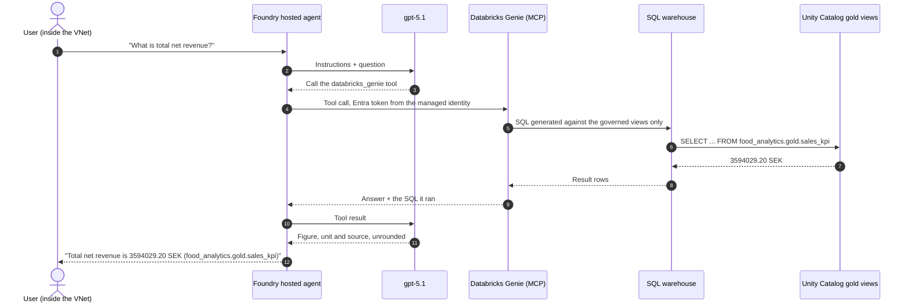

# Food Analytics Genie

**A network-isolated Microsoft Foundry agent and a Power BI dashboard that give the same
answer, because both read the same governed metric definitions in Azure Databricks.**

Ask the agent *"What is total net revenue?"* and it returns **3,594,029.20 SEK**: the same
figure, to the cent, as the Power BI card. The agent never calculates the number itself. It
asks a Databricks Genie space, which queries governed Unity Catalog views, and every hop runs
over private endpoints with managed identities. No secrets are stored anywhere.

| | |
|---|---|
| **Agent** | Microsoft Foundry hosted agent (Agent Framework, Responses protocol), `gpt-5.1` |
| **Tool** | Databricks Genie, exposed to Foundry as an MCP tool through a project connection |
| **Data** | Unity Catalog `food_analytics.gold` views on a Pro SQL warehouse |
| **BI** | Power BI semantic model (import mode, DAX measures) over the same views |
| **Network** | Foundry and Databricks both have public network access **disabled** |
| **Identity** | Managed identities end to end; no keys, secrets or connection strings |

---

## Architecture


```mermaid
flowchart LR
    user(["Presenter / business user"])

    subgraph azure["Azure subscription · single region"]
        subgraph vnet["Virtual network 10.19.0.0/16 · no public data plane"]
            jumpbox["Jumpbox VM<br/>Edge · azd · Power BI Desktop<br/>system-assigned identity"]

            subgraph pe["Private endpoints subnet"]
                pe_foundry["PE: Foundry account"]
                pe_dbx["PE: Databricks UI/API<br/>+ browser auth"]
                pe_storage["PE: ADLS Gen2"]
            end

            subgraph foundry["Microsoft Foundry · public access disabled"]
                agent["Hosted agent<br/>food-analytics-genie"]
                model["Model deployment<br/>gpt-5.1"]
                toolbox["Toolbox<br/>food-analytics-tools"]
                connection["Project connection<br/>databricks-genie<br/>ProjectManagedIdentity"]
            end

            subgraph dbx["Azure Databricks Premium · VNet-injected · public access disabled"]
                genie["Genie space<br/>Food Analytics"]
                warehouse["Pro SQL warehouse"]
                uc[("Unity Catalog<br/>food_analytics.gold<br/>sales_analytics · waste_analytics · sales_kpi")]
            end

            storage[("ADLS Gen2<br/>Unity Catalog storage<br/>public access disabled")]
        end
    end

    user -- "RDP, single source IP" --> jumpbox
    jumpbox -- "playground / azd ai agent invoke" --> pe_foundry --> agent
    agent -- "reasoning" --> model
    agent -- "MCP tool call" --> toolbox --> connection
    connection -- "Entra token, aud = AzureDatabricks" --> pe_dbx --> genie
    genie -- "generated SQL" --> warehouse --> uc
    uc -. "managed tables" .-> pe_storage --> storage
    jumpbox -- "Power BI import refresh" --> pe_dbx
```

A slide-ready copy of this diagram is in [docs/images/architecture.png](docs/images/architecture.png),
and the design is explained in detail in [docs/architecture.md](docs/architecture.md).

### What happens when someone asks a question


```mermaid
sequenceDiagram
    autonumber
    actor U as User (inside the VNet)
    participant A as Foundry hosted agent
    participant M as gpt-5.1
    participant G as Databricks Genie (MCP)
    participant W as SQL warehouse
    participant V as Unity Catalog gold views

    U->>A: "What is total net revenue?"
    A->>M: Instructions + question
    M-->>A: Call the databricks_genie tool
    A->>G: Tool call, Entra token from the managed identity
    G->>W: SQL generated against the governed views only
    W->>V: SELECT ... FROM food_analytics.gold.sales_kpi
    V-->>W: 3594029.20 SEK
    W-->>G: Result rows
    G-->>A: Answer + the SQL it ran
    A->>M: Tool result
    M-->>A: Figure, unit and source, unrounded
    A-->>U: "Total net revenue is 3594029.20 SEK (food_analytics.gold.sales_kpi)"
```

The agent's instructions require a tool call for **every** numeric question, forbid
rounding or recalculating the result, and tell it to stop and say so if the tool fails,
instead of inventing table names. See [agent/main.py](agent/main.py).

### Why the agent and the dashboard agree

Three views in `food_analytics.gold` are the single source of truth:

| View | Grain | Used for |
|---|---|---|
| `sales_analytics` | day × product × store | any filtered or grouped sales question |
| `waste_analytics` | day × product × store | any filtered or grouped waste question |
| `sales_kpi` | one row per headline metric | headline cards and headline questions |

- The **Genie space** is pointed at these three views only. The raw fact and dimension
  tables are excluded, so Genie cannot derive its own aggregates.
- Genie also gets value dictionaries, phrasing-to-metric instructions and example SQL
  for every headline question, so "gross margin percentage" always resolves to the same row.
- The **Power BI model** imports the same views and defines the metrics as DAX measures
  (`Net Revenue = SUM(net_revenue)`, `Gross Margin % = DIVIDE([Gross Margin], [Net Revenue])`).

---

## Repository layout

| Path | Contents |
|---|---|
| [agent/](agent/) | Hosted agent (`main.py`), toolbox spec, unit tests for the whole repo |
| [deployment/template-19/](deployment/template-19/) | Vendored Foundry *private network agent tools* template ([provenance](deployment/TEMPLATE19_SOURCE.md)) |
| [deployment/](deployment/) | Databricks, Unity Catalog, private link, jumpbox and connection templates, plus operations scripts |
| [powerbi/](powerbi/) | Power BI project (PBIP: TMDL semantic model + PBIR report) |
| [docs/deployment-plan.md](docs/deployment-plan.md) | Gated deployment runbook, operating notes and known risks |
| [docs/architecture.md](docs/architecture.md) | Detailed architecture, identity chain and design decisions |
| [azure.yaml](azure.yaml) | `azd` manifest for the hosted agent only. Infrastructure is owned by Template 19 |

All environment identifiers live in `deployment/environment.json`, which is git-ignored.
The repository ships [deployment/environment.example.json](deployment/environment.example.json)
with placeholders.

---

## Step-by-step deployment

> Follow [docs/deployment-plan.md](docs/deployment-plan.md) for the gated version with the
> reasons behind each step. Every step that creates or exposes resources needs explicit
> approval in your organisation.

### 0. Prerequisites

- An Azure subscription where you hold **Owner**, or **Contributor + User Access
  Administrator**: the templates create role assignments.
- **Foundry Project Manager** on the Foundry account once it exists. Subscription Owner
  does not include Foundry data-plane actions.
- `gpt-5.1` quota in your region (the reference deployment used `swedencentral` with
  100K TPM; 10K TPM ran out during a three-question rehearsal).
- Resource providers registered: `Microsoft.CognitiveServices`, `Microsoft.DocumentDB`,
  `Microsoft.Search`, `Microsoft.Network`, `Microsoft.App`, `Microsoft.ContainerRegistry`,
  `Microsoft.KeyVault`, `Microsoft.Databricks`, `Microsoft.Compute`.
- Tools: Azure CLI with Bicep, Azure Developer CLI `>= 1.27.1`, PowerShell 7, Python 3.13.

```powershell
az login --tenant <tenant-id>
azd auth login --tenant-id <tenant-id>   # azd defaults to a different tenant than az
python -m pip install -e "./agent[test]"
python -m pytest agent/tests -q          # must pass before anything is deployed
```

### 1. Describe your environment

```powershell
Copy-Item deployment/environment.example.json deployment/environment.json
```

Fill in the subscription, resource group, region and jumpbox name now. The remaining values
(Foundry names, workspace URL, warehouse ID, Genie space ID, identity client IDs) are filled
in as the steps below create them. Scripts refuse to run while a `<placeholder>` remains.

### 2. Network, Foundry and model (Template 19)

Create the resource group and an empty NSG for the Databricks subnets, then deploy the
private Foundry account, project, `gpt-5.1` deployment, VNet, subnets and private endpoints:

```powershell
az group create -n <resource-group> -l <region>
az network nsg create -g <resource-group> -n nsg-databricks -l <region>
$env:DATABRICKS_NSG_ID = az network nsg show -g <resource-group> -n nsg-databricks --query id -o tsv

az deployment group what-if -g <resource-group> --parameters deployment/food-analytics.bicepparam
az deployment group create  -g <resource-group> --parameters deployment/food-analytics.bicepparam
```

Review the `what-if` output before every `create`. Two warnings from the vendored template
(`BCP037`, `BCP321`) are upstream and expected.

### 3. Databricks workspace and Unity Catalog storage

Deploy the workspace **with public access enabled** for now. Creating it private first
locks you out of the API you need for setup.

```powershell
az deployment group create -g <resource-group> -f deployment/databricks-workspace.bicep `
    -p location=<region> vnetName=<vnet-name>
az deployment group create -g <resource-group> -f deployment/databricks-uc-storage.bicep `
    -p location=<region> vnetName=<vnet-name>
```

Then, in the Databricks workspace (these steps are not scripted):

1. Create a storage credential from the Access Connector, and an external location on the
   Unity Catalog container. The control plane cannot reach the private storage account,
   so validation has to be skipped. The warehouse reading the data proves the path instead.
2. Create the `food_analytics` catalog and `gold` schema on that location.
3. Create a **Pro** SQL warehouse with `auto_stop_mins = 60`, and record its ID in
   `environment.json` along with the workspace URL.

### 4. Seed the data and build the governed views

```powershell
./deployment/seed-databricks-gold.ps1 -WorkspaceUrl <workspace-url> -WarehouseId <warehouse-id>
```

This creates five tables in `food_analytics.gold` (dates, products, stores, sales, waste)
with column comments. Genie uses those comments as context.

### 5. Jumpbox

Toolboxes, agent deployment, agent invocation and the Foundry playground are all
**data-plane** operations, so they need a client inside the VNet.

```powershell
az deployment group create -g <resource-group> -f deployment/jumpbox.bicep `
    -p location=<region> vnetName=<vnet-name> allowedSourceIp=<your-public-ip>/32
# Azure CLI prompts for adminPassword; it is a @secure() parameter with no default.
```

RDP is allowed from that one address only. Register the jumpbox identity in Databricks as a
workspace admin with `MANAGE` on the catalog, and record its client ID as
`JumpboxIdentityId`. Without that, nobody can administer the workspace once it is private.

From here on, Databricks scripts run on the jumpbox through one launcher that fills their
parameters from `environment.json`:

```powershell
./deployment/Invoke-OnJumpbox.ps1 ./deployment/jumpbox-create-shared-views.ps1
./deployment/Invoke-OnJumpbox.ps1 ./deployment/create-genie-space.ps1
```

The first creates the three governed views. The second creates (or updates) the Genie space
over those views only. Record the Genie space ID it prints.

### 6. Connect Foundry to Genie

The connection is an ARM resource, so it deploys from anywhere:

```powershell
az deployment group create -g <resource-group> -f deployment/foundry-connections.bicep `
    -p foundryAccountName=<account> foundryProjectName=<project> `
       databricksHost=<workspace-url> genieSpaceId=<genie-space-id>
```

It uses `ProjectManagedIdentity` with the AzureDatabricks application ID as the token
audience. Databricks rejects the `https://azuredatabricks.net/` audience form with HTTP 400.

### 7. Grant the Foundry identities in Databricks

Both the Foundry **account** and **project** system-assigned identities appear as callers,
depending on the stage of the request. Grant both, or failures look intermittent.

```powershell
./deployment/grant-databricks-identity.ps1 -ApplicationId <account-identity-client-id> -DisplayName foundry-account
./deployment/grant-databricks-identity.ps1 -ApplicationId <project-identity-client-id> -DisplayName foundry-project
```

Each identity gets workspace entitlements, `CAN_RUN` on the Genie space, `CAN_USE` on the
warehouse, and `USE_CATALOG` / `USE_SCHEMA` / `SELECT` in Unity Catalog. It is **never**
made a workspace admin. The script reads the grants back, because Unity Catalog can
silently drop a grant on a principal it has only just seen.

### 8. Toolbox and hosted agent

```powershell
./deployment/run-on-jumpbox.ps1
```

This ships the agent source to the jumpbox and, from inside the VNet, creates the
`food-analytics-tools` toolbox and runs `azd deploy` for the hosted agent.

### 9. Lock everything down

Redeploy the workspace with `publicNetworkAccess=Disabled` and
`requiredNsgRules=NoAzureDatabricksRules`, then add its private endpoints:

```powershell
az deployment group create -g <resource-group> -f deployment/databricks-workspace.bicep `
    -p location=<region> vnetName=<vnet-name> publicNetworkAccess=Disabled requiredNsgRules=NoAzureDatabricksRules
az deployment group create -g <resource-group> -f deployment/databricks-private-link.bicep `
    -p location=<region> databricksWorkspaceResourceId=<workspace-resource-id> vnetName=<vnet-name> peSubnetName=snet-private-endpoints
```

Stop the warehouse before the workspace update; updates fail while compute is running.
Network changes take two to four minutes to apply, in both directions.

### 10. Verify

```powershell
./deployment/Invoke-OnJumpbox.ps1 ./deployment/jumpbox-verify-private-path.ps1   # 10.19.x address, HTTPS 200
./deployment/Invoke-OnJumpbox.ps1 ./deployment/jumpbox-demo-test.ps1             # warms the warehouse, asks 3 questions
./deployment/Invoke-OnJumpbox.ps1 ./deployment/jumpbox-verify-kpi-parity.ps1     # agent vs sales_kpi side by side
```

From the workstation, the Databricks workspace must return **HTTP 403**.

### 11. Power BI

```powershell
./deployment/Invoke-OnJumpbox.ps1 ./deployment/jumpbox-install-powerbi.ps1
./deployment/push-powerbi-to-jumpbox.ps1
```

The push script fills the model's connection parameters from `environment.json`. Then RDP to
the jumpbox, open `C:\powerbi\FoodAnalytics.pbip`, select **Refresh** and sign in with
**Microsoft Entra ID**. A presenter needs their own Unity Catalog `SELECT` on the gold views
to refresh the model or use Genie in the browser.

---

## Running the demo

1. **Warm up**, about 10 minutes before you start. A stopped Pro warehouse takes around 6 minutes to start,
   and Genie times out against a cold one:
   `./deployment/Invoke-OnJumpbox.ps1 ./deployment/jumpbox-demo-test.ps1`
2. **Genie** (Databricks UI on the jumpbox): ask
   *"Which product categories generated the most net revenue in 2025?"* and expand the SQL.
3. **Foundry playground**: ask the same question, then *"What is total net revenue?"*. Start
   a new chat for each question so the agent queries afresh. Open the trace to show the
   `databricks_genie` tool call.
4. **Power BI**: with no year selected, the cards show the same headline figures. Select
   2025 and the category and region charts match the agent's 2025 answers.

| Question | Expected answer |
|---|---|
| What is total net revenue? | 3,594,029.20 SEK |
| What is the gross margin percentage? | 24.34 % |
| What is the total food waste cost? | 186,345.56 SEK |
| Which product categories generated the most net revenue in 2025? | Seafood 245,055.46 SEK first, Snacks 37,102.77 SEK last |
| Compare gross margin percentage by store region for 2025. | Norrland 24.36 %, Svealand 24.31 %, Götaland 24.27 % |

**Always include a period in the question.** Without one, Genie may choose a single month,
and two runs of the same question can return different figures.

---

## Known limitations

- **One identity for every user.** Genie is called with a single managed identity, so Unity
  Catalog sees the same principal for everyone. Row- and column-level security is **not**
  enforced per user through the agent.
- **Import mode is a snapshot.** The dashboard reflects its last refresh, and the agent
  queries live data. They agree today because the demo data is static.
- **The agent reads the Databricks views, not the Power BI model.** For sums and simple ratios
  the results are identical. Time intelligence, calculation groups and model RLS defined in
  DAX have no Genie equivalent.
- **Waste does not follow the year slicer.** `Sales Analytics` and `Waste Analytics` have no
  shared date table, so the waste card always shows the all-time total. A shared date
  dimension fixes this.
- **Cold starts.** The Pro warehouse needs minutes to start. Serverless would be faster, but
  reaching private storage from serverless needs a Network Connectivity Config, which needs
  a Databricks account admin.
- **Genie shows SEK as `$`** in its own UI. This is cosmetic: column comments and agent answers use SEK.

The full list, including the accepted risks, is in
[docs/deployment-plan.md](docs/deployment-plan.md#4-known-blockers-and-accepted-risks).

## Cost control

Deallocate the jumpbox and let the warehouse auto-stop when you aren't presenting:

```powershell
./deployment/Invoke-OnJumpbox.ps1 ./deployment/jumpbox-warehouse.ps1 -Parameters @{ Action = 'stop' }
az vm deallocate -g <resource-group> -n <jumpbox-name>
```

## Testing

```powershell
python -m pytest agent/tests -q
```

The tests check the design rules as well as the code, including:
- no stored credentials
- no environment identifiers in committed files
- Genie reads only the governed views
- Genie's metric names match `sales_kpi`
- the Power BI cards show full values
- no visual mixes unrelated tables
- RDP is restricted to a single source address

## Acknowledgements

Network and Foundry infrastructure is based on template
`19-private-network-agent-tools` from
[microsoft-foundry/foundry-samples](https://github.com/microsoft-foundry/foundry-samples),
with the deviations listed in [deployment/TEMPLATE19_SOURCE.md](deployment/TEMPLATE19_SOURCE.md).
