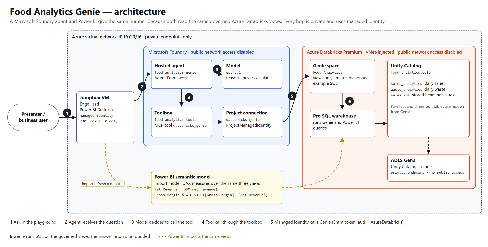
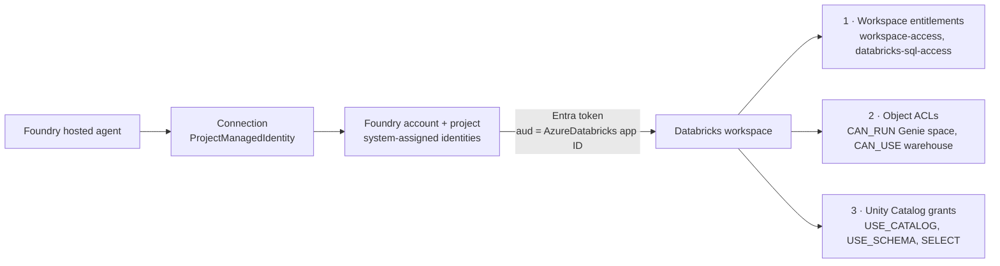
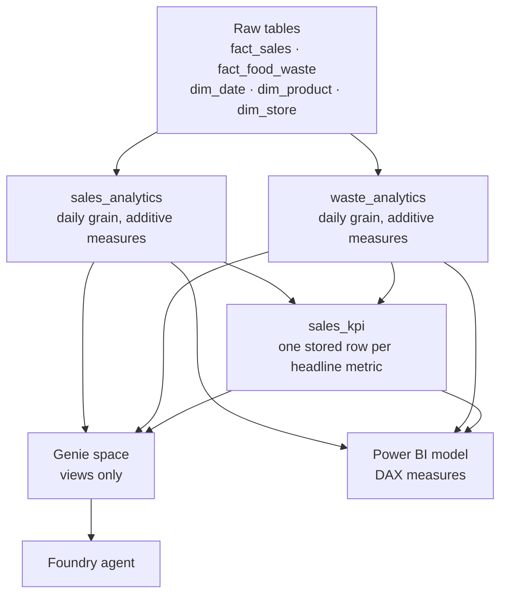

# Architecture

This document explains how the Food Analytics Genie demo is built and why. For deployment
steps see the [README](../README.md); for the gated runbook see
[deployment-plan.md](deployment-plan.md).

## 1. Goal

A business user asks a question in natural language and gets **the same number the BI
dashboard shows**. Three properties make that claim trustworthy:

1. **One definition.** The agent and the dashboard read the same governed views.
2. **No invention.** The model never calculates a governed metric; it reports what the
   data platform returns, and it says so when the tool fails.
3. **No exposure.** Every component that stores or serves data has public network access
   disabled, and nothing authenticates with a stored secret.

## 2. Components

| Layer | Resource | Role |
|---|---|---|
| Client | Jumpbox VM (Windows Server) | The only in-VNet client: Foundry playground, `azd`, Databricks UI, Power BI Desktop |
| Agent | Foundry hosted agent `food-analytics-genie` | Agent Framework app on the Responses protocol, deployed with `azd` |
| Model | `gpt-5.1` deployment (Standard, 100K TPM) | Reasoning and answer composition only |
| Tools | Foundry toolbox `food-analytics-tools` | Exposes a single MCP tool, `databricks_genie` |
| Connection | Project connection `databricks-genie` | `RemoteTool` connection to the Genie MCP endpoint, authenticated with `ProjectManagedIdentity` |
| Semantic layer | Databricks Genie space `Food Analytics` | Turns questions into SQL over the governed views only |
| Compute | Databricks Pro SQL warehouse | Runs Genie's SQL and the Power BI import queries |
| Governance | Unity Catalog `food_analytics.gold` | Tables, governed views, grants and column comments |
| Storage | ADLS Gen2 + Access Connector | Unity Catalog managed storage, reached privately |
| BI | Power BI semantic model (PBIP) | Import mode, DAX measures over the same views |
| Platform | Key Vault, Container Registry, AI Search, Cosmos DB, Storage, App Insights | Provisioned by Template 19 for the Foundry agent service, all behind private endpoints |

## 3. Network

All resources share one VNet (`10.19.0.0/16`) in one region.

| Subnet | Prefix | Purpose |
|---|---|---|
| `snet-foundry-agent` | 10.19.0.0/24 | Foundry agent service, delegated (capability host) |
| `snet-private-endpoints` | 10.19.1.0/24 | Private endpoints for Foundry, Databricks, storage and platform services |
| `snet-mcp-tools` | 10.19.2.0/24 | Reserved for self-hosted MCP servers |
| Databricks host | 10.19.3.0/24 | Databricks VNet injection, delegated, shared NSG |
| Databricks container | 10.19.4.0/24 | Databricks VNet injection, delegated, shared NSG |
| `snet-jumpbox` | 10.19.5.0/24 | Jumpbox; NSG allows RDP from one source address only |

- **Foundry** has `publicNetworkAccess: Disabled`. Creating toolboxes, deploying the
  agent, invoking it and using the portal playground are all data-plane operations, so they
  work only from inside the VNet. ARM operations, such as creating connections, work from anywhere.
- **Databricks** is VNet-injected with secure cluster connectivity, so cluster nodes have no public IPs.
  `publicNetworkAccess` is Disabled with `requiredNsgRules: NoAzureDatabricksRules`, and it is reached through a
  `databricks_ui_api` private endpoint plus a `browser_authentication` endpoint for SSO.
  From outside the VNet the workspace returns HTTP 403.
- **Storage** for Unity Catalog has public access disabled. The Databricks control plane
  cannot validate the external location, so it is registered with `skip_validation`. The
  warehouse reading and writing `food_analytics.gold` proves the path.
- **Monitoring**: log query over the Azure Monitor Private Link Scope is `PrivateOnly`, so
  portal and CLI log queries also need an in-VNet client.

## 4. Identity and authorization

No keys, client secrets or personal access tokens exist anywhere in the design.

All three Databricks authorities are required, and each one fails in a different way:

| Missing | Symptom |
|---|---|
| Workspace entitlements | HTTP 403 on every call |
| Object ACLs | `PERMISSION_DENIED` on the Genie space |
| Unity Catalog grants | Genie reports that the warehouse query failed. **The model may then propose plausible SQL against table names that do not exist**, so treat invented schema as a permissions failure. |

**Why managed identity rather than a Databricks OAuth secret?** Minting a Databricks
service-principal secret needs a Databricks account admin, and that role requires Entra
Global Administrator. On-behalf-of tokens for service principals were also disabled.
Registering the Foundry managed identities as Databricks service principals avoids storing
and rotating any credential.

**The trade-off:** an Entra token is not scope-limited the way a Databricks OAuth token
can be, for example to `genie` only. Least privilege therefore rests entirely on Databricks
object permissions: the Foundry identities hold only `CAN_RUN`, `CAN_USE` and `SELECT`, and
are never workspace admins.

**Two identities, both granted.** Depending on the stage of the request, Databricks sees
either the Foundry **account** or the **project** system-assigned identity as the caller.
Granting only one produces intermittent failures that look like caching.

**Operators.** The jumpbox's managed identity is a Databricks workspace admin and holds
`MANAGE` on the catalog. Once public access is disabled it is the only identity that can
administer the workspace. A human presenting Genie or refreshing Power BI needs their own
Unity Catalog `SELECT`, because Genie and the Power BI connector run as the signed-in user.

## 5. Metric governance

- **Genie never sees the raw tables.** If they were available, Genie could compute its own
  aggregates and disagree with the dashboard.
- **`sales_kpi` stores the headline values.** Its `COMMENT` tells Genie not to recalculate,
  and Genie reads comment metadata as context.
- **Pointing Genie at the views was not enough.** Asked for "gross margin percentage",
  Genie matched `LIKE '%gross margin%'` and sometimes returned *Gross Margin* (SEK). The
  space therefore also carries:
  - a value dictionary on `metric_name`
  - text instructions that map each phrasing to one exact metric name
  - example SQL for every headline question

  A unit test keeps those names identical to the view.
- **The agent instructions** require a tool call for every numeric question, even a repeated
  one, and forbid rounding, rescaling or reinterpreting the returned value.
- **Power BI** defines the metrics as DAX measures over the additive view columns, for example
  `Gross Margin % = DIVIDE([Gross Margin], [Net Revenue])`, which is a ratio of sums. The
  `Dashboard KPI` table imports `sales_kpi`, so the Databricks figure can be shown next to
  the Power BI one.

## 6. Design decisions

| Decision | Alternative | Why |
|---|---|---|
| Template 19 (private network agent tools) owns all Foundry infrastructure | `azd` provisioning | `azd` infrastructure would create a separate, public Foundry project. `azure.yaml` deliberately declares only the agent service. |
| Hosted agent with a toolbox | Prompt agent with a direct MCP tool | Keeps tool wiring and authentication in Foundry configuration rather than in agent code, and lets the agent's instructions be versioned with its source. |
| Genie as the only tool | Agent-generated SQL | Genie applies the space's instructions, value dictionaries and Unity Catalog permissions. The model never writes SQL. |
| Pro SQL warehouse | Serverless | Serverless reaching private storage needs a Network Connectivity Config, which needs a Databricks account admin. |
| Power BI import mode | DirectQuery | Import mode is the customer's standard. The trade-off is a snapshot between refreshes. |
| No Microsoft Fabric | Fabric data agent over the semantic model, OneLake | Databricks owns the metrics in this design. Fabric Private Link is tenant-wide, so it cannot be scoped to a demo, and querying a semantic model needs Fabric capacity or PPU plus tenant-admin consent. See the [README](../README.md#why-microsoft-fabric-is-not-included). |
| Jumpbox with single-IP RDP | Azure Bastion | Lowest cost for a demo. Use Bastion or just-in-time access in production; see section 8. |
| `conversation_id` forwarded to MCP tools | Framework default | Agent Framework strips `conversation_id` from tool arguments, but Genie's `poll_response` tool needs it. Without it, any query still running after the first call fails. |

## 7. Operations

| Task | How |
|---|---|
| Start or stop the warehouse | `Invoke-OnJumpbox.ps1 jumpbox-warehouse.ps1` |
| Rehearse the demo | `Invoke-OnJumpbox.ps1 jumpbox-demo-test.ps1` |
| Check agent vs dashboard parity | `Invoke-OnJumpbox.ps1 jumpbox-verify-kpi-parity.ps1` |
| Diagnose Genie without the agent | `Invoke-OnJumpbox.ps1 jumpbox-diagnose-genie.ps1 -Parameters @{ Question = '...' }` |
| Inspect grants | `Invoke-OnJumpbox.ps1 jumpbox-dump-grants.ps1` |
| Change the Genie space | Edit and re-run `create-genie-space.ps1`, which is the space's only definition |
| Redeploy the agent | `run-on-jumpbox.ps1` |
| Update Power BI on the jumpbox | `push-powerbi-to-jumpbox.ps1`, then refresh in Desktop |

`Invoke-OnJumpbox.ps1` sends a script through `az vm run-command` and fills every parameter
the script declares from `deployment/environment.json`, so no environment identifier is
hard-coded in the repository.

## 8. Moving towards production

- **Per-user data security**: pass the end user's identity through to Databricks instead of
  a shared managed identity, so Unity Catalog row filters and column masks apply per person.
- **Operator access**: replace public RDP with Azure Bastion or just-in-time VM access, or
  run the Foundry and Databricks operations from a CI agent inside the VNet.
- **Shared date dimension**: link `sales_analytics` and `waste_analytics` to a single date
  table, so one slicer filters both.
- **Semantic model as the metric authority**: if Power BI owns the definitions, query the
  semantic model through XMLA, or the Fabric semantic model MCP, and keep Genie for
  exploration.
- **Warehouse start-up**: serverless SQL with a Network Connectivity Config removes the
  multi-minute cold start.
- **Evaluation**: add a Foundry evaluation suite that asks the headline questions and
  compares the answers with `sales_kpi`, and run it after every agent or Genie change.
