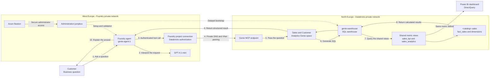

# Foundry and Databricks Genie Demo

## Demo summary

This demo shows how a Microsoft Foundry agent can answer business questions using sales data held in Azure Databricks, and how a Power BI dashboard built on the same data always shows matching figures. A customer asks a question in normal business language, such as "What was the total sales volume by product category last quarter?" The Foundry agent understands the request but does not invent the figures. It calls a Databricks Genie MCP endpoint, Genie converts the question into SQL, and the SQL warehouse runs that query against the sales dataset. The verified result is then returned to the Foundry agent, which explains it in clear business language.

The demonstration uses synthetic food-manufacturing data rather than real customer records. It includes sales transactions, products, customers, and manufacturing plants. This makes it possible to demonstrate questions about sales volume, revenue, cost, product categories, customer channels, geography, and plant performance without exposing production data.

## What was built

Microsoft Foundry is deployed in West Europe. The Foundry account, the project, and the `gpt-4.1-mini` model deployment are created by the deployment scripts. The project contains `genie-agent:1`, a prompt agent instructed to use Databricks Genie whenever an answer requires business data and never to guess figures.

Azure Databricks is deployed in North Europe as `dbx-food-analytics-ne`. It contains the `genie-warehouse` SQL warehouse and a Genie space named **Sales and Customer Analytics**. The sales data sits in the `<catalog>.sales` schema:

- `fact_sales` contains sales transactions, dates, volume, revenue, and cost.
- `dim_product` describes products, brands, and product categories.
- `dim_customer` describes customer accounts, channels, countries, and regions.
- `dim_plant` describes the manufacturing plants.

Two views sit on top of those tables and define the shared business metrics:

- `sales_analytics` aggregates daily volume, revenue, cost, and gross margin by product, customer, and plant attributes.
- `sales_kpi` returns the all-time dashboard totals, one row per metric.

The Genie space exposes only these two views, and the Power BI semantic model reads the same two views over DirectQuery. That is the mechanism that keeps the agent's answer and the dashboard figure identical.

The Foundry agent reaches Databricks through the Genie MCP endpoint. MCP, or Model Context Protocol, gives the agent a standard way to call an external tool. In this solution, the external tool is Genie, which understands the data model and can safely translate business questions into SQL.

The environments are isolated from public network access. Foundry uses the `10.100.0.0/16` virtual network in West Europe and Databricks uses the `10.200.0.0/16` virtual network in North Europe. The two networks are peered, and private DNS resolves the Databricks workspace address to its private endpoint. Azure Bastion and a jumpbox provide the controlled administration route used to configure and test the solution.

## Architecture

The solid arrows show the live question-and-answer flow. The dotted arrows show administration and setup activities. There is no public runtime path between Foundry and Databricks: private DNS and VNet peering keep the connection on the Azure network.

Both the agent and the Power BI dashboard read the shared metric views, which is why the same question produces the same number on either surface.

## Customer demonstration walkthrough

### 1. Introduce the business scenario

Start by explaining that business users often know the question they want to ask but do not know the database structure or SQL. This solution lets them use familiar business language while preserving Databricks as the system that calculates and returns the figures.

A useful opening statement is: "Today we will ask an AI agent a sales question in plain English. The agent will securely ask Databricks Genie to calculate the answer from governed data, and then it will explain that answer back to us."

### 2. Show the data foundation

Open the **Sales and Customer Analytics** Genie space in Databricks. Show that it uses `genie-warehouse` and that the two shared views are attached. Explain that `sales_analytics` holds the measurable transactions already enriched with product, customer, and plant context, and that `sales_kpi` holds the headline totals.

Make the governance point here: the space exposes views, not raw tables. The business definition of revenue, cost, and gross margin is written once in SQL, so every consumer inherits the same definition.

Point out that Genie uses the view structure, column descriptions, and relationships to understand business terms. For example, it can associate "sales volume" with the volume column, "product category" with product master data, and "last quarter" with the transaction date.

### 3. Show the Foundry agent

Open the Foundry project and show the `genie-agent` definition. Explain that `gpt-4.1-mini` handles the conversation and presentation, while the Genie MCP tool handles data questions. This distinction is important: the language model does not estimate the figures. Databricks queries and calculates them.

The agent instruction explicitly says to use Genie for questions requiring data, to use `sales_kpi` for headline totals and `sales_analytics` for filtered analysis, and to report the returned value without recalculating it. The MCP tool is configured with the private Genie URL and the Foundry project connection named `databricks-genie-mcp`.

### 4. Ask the demonstration question

Use the verified question:

> What was the total sales volume by product category for last quarter?

Explain that the customer only supplies the question. They do not select tables, define joins, or write SQL.

### 5. Explain what happens behind the scenes

The Foundry agent first recognizes that the question requires business data. It invokes the Genie MCP tool using the secure project connection. Private DNS resolves the Databricks hostname to a private IP address, and the request crosses the peered Azure virtual networks from West Europe to North Europe.

Genie examines the question and the configured sales model. It identifies the sales volume measure, applies the relevant date period, groups the values by product category, and submits the generated SQL to `genie-warehouse`. The warehouse executes the query against the shared views and returns the calculated rows to Genie.

Genie sends the structured result back through MCP. The Foundry agent then turns those rows into a concise customer response, while preserving the values calculated by Databricks.

### 6. Present the verified result

The completed end-to-end test returned:

| Product category | Total sales volume |
| --- | ---: |
| Bakery | 1,063,484 kg |
| Margarine | 906,776.4 kg |
| Oils & Fats | 602,334.3 kg |

The agent also explained that Bakery had the highest total sales volume. This is the key demonstration outcome: the response is conversational, but its figures come from a live Databricks query rather than the language model's general knowledge. The fact table is generated with randomized volumes, so your own totals will differ.

### 7. Show the same number in Power BI

This is the step that usually decides whether an audience trusts the agent.

Open the Power BI dashboard from `powerbi/FoodAnalytics.pbip` and show the four KPI cards. Then ask the agent the matching question, for example "What is total revenue?" and place the two side by side.

The values match exactly, because the card and the agent both read the same `sales_kpi` row. Neither surface calculates the total independently. Repeat with gross margin or sales volume if the audience wants further proof.

The business point to make is that this removes the usual reconciliation argument. When an agent and a dashboard disagree, adoption stops. Here they cannot disagree without someone deliberately changing the shared view, and that change would move both surfaces together.

If you want to demonstrate the dimensional path as well, use the category bar chart and ask the agent for revenue by product category. Both resolve through `sales_analytics`.

### 8. Continue with follow-up questions

After showing the first answer, demonstrate that the same governed data can support further business questions. Suitable examples include:

- "Which customers generated the most revenue?"
- "Compare bakery sales by country."
- "Show monthly revenue by customer channel."
- "Which manufacturing plant supplied the largest sales volume?"
- "What was the gross margin by product category?"

For every follow-up, remind the audience that Genie is responsible for generating and running the SQL. The Foundry agent provides the conversational experience and can explain the result in terms suitable for the user.

### 9. Explain the security design

Finish by showing the architecture diagram. Public access is disabled for the Foundry and Databricks environments. Foundry and Databricks communicate through private endpoints, private DNS, and bidirectional VNet peering. Administrators use Azure Bastion to enter the jumpbox rather than exposing the VM directly to the internet.

The Databricks credential is not stored in the Python source code. It is held by the Foundry project connection and referenced by the agent. The current sandbox connection uses a short-lived Databricks personal access token created for validation.

## What the demo proves

The demo proves that a Foundry agent can use Databricks Genie as a private enterprise data tool, and that a Power BI dashboard over the same governed views reports identical figures. It combines a natural-language customer experience with SQL-based answers from a governed analytics platform. It also demonstrates that Foundry and Databricks can operate in different Azure regions while communicating privately through peered networks and private DNS.

The completed validation created `genie-agent:1`, invoked the private Genie MCP endpoint, queried the sales data, and returned the product-category totals with exit code `0`.

## Operational note

The current sandbox Databricks token expires 24 hours after it was created. Once it expires, the `databricks-genie-mcp` connection must be updated with a new credential before the live demonstration can run again. For production, replace this temporary token design with Databricks OAuth identity passthrough or another managed, renewable identity approach. This removes manual token rotation and provides a more appropriate long-term authentication model.
